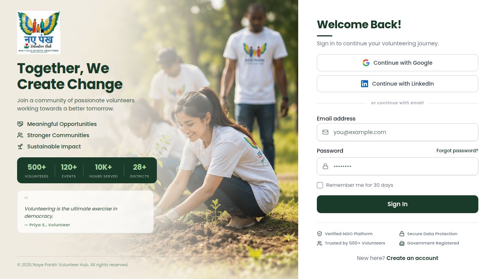

# 🌿 NayePankh Volunteer Hub

> *"Volunteers don't necessarily have the time — they have the heart."*

NayePankh Volunteer Hub is a full-stack web platform built to bring order, transparency, and motivation to volunteer operations. Whether you're a student giving your first weekend to a cause, a coordinator juggling ten events at once, or an admin watching the organisation grow — this platform has a dedicated space built just for you.

---



---

## What Problem Does It Solve?

Managing volunteers manually is chaos. WhatsApp groups get cluttered. Spreadsheets go out of date. Certificates get lost. Nobody knows who showed up to what. NayePankh Volunteer Hub fixes all of that in one place — event management, attendance tracking, certificates, leaderboards, reports, and more — with every user seeing exactly what they need and nothing they don't.

---

## Who Uses It?

The platform has **three distinct roles**, each with its own dashboard and set of permissions:

### 🌱 Volunteer
A student or community member who wants to contribute their time.

**Real use case:** Priya signs up, browses upcoming events like "Tree Plantation Drive" and "Blood Donation Camp", applies to the ones that fit her schedule, tracks her hours accumulate over time, watches her level go from *Beginner Volunteer* 🌱 to *Community Helper* 🌿 to *Impact Leader* 🌳, and downloads her certificates to put on her resume.

**What they see:**
- Personal dashboard with an animated photo banner and rotating motivational quotes
- Live stats: total hours logged, events attended, badges earned, certificates issued
- A volunteer journey strip showing their progress level (Beginner → Champion)
- Upcoming events they can apply to with one click
- Their position on the leaderboard
- Notifications for approvals, rejections, and updates

---

### 📋 Coordinator
A team lead or event manager who handles day-to-day operations on the ground.

**Real use case:** Rahul is coordinating a literacy camp. He logs in, sees his dashboard showing 3 upcoming events and 12 pending applications. He approves the volunteers he knows, rejects duplicates, marks attendance on the day of the event, and moves on to the next one — all without touching a spreadsheet.

**What they see:**
- Dashboard with stats (total volunteers, pending applications, active events)
- Bar chart showing volunteer participation trends
- Pending applications they can approve or reject in one click
- Attendance marking — check who showed up, log hours
- Event listings with status filters (Upcoming / Ongoing / Completed / Cancelled)

---

### 🛡️ Admin
The organisation head who needs the full picture at all times.

**Real use case:** Ananya is the NayePankh admin. She opens her dashboard on Monday morning and sees: 142 total volunteers, 8 events this month, 94 certificates issued, and a trend chart showing volunteer growth over 6 months. She creates a new event, reviews the leaderboard, generates a CSV report for a grant application, checks the audit log to see who made what changes, and adds a new coordinator to the system.

**What they see:**
- Full analytics dashboard with area charts, bar charts, and pie charts
- Volunteer growth trend (6-month view)
- Application status breakdown
- Top 5 volunteers on the leaderboard
- Access to all management tools: Events, Volunteers, Applications, Reports, Audit Log, Skills

---

## Features at a Glance

### 🎯 Event Management
- Create, edit, cancel, and delete events
- Each event has a title, description, date, location, and capacity
- Status lifecycle: `UPCOMING → ONGOING → COMPLETED` (or `CANCELLED`)
- Volunteers can apply, and admins/coordinators can approve or reject
- Volunteers can withdraw their applications before an event starts
- Search and filter by status, with pagination

### ✅ Attendance Tracking
- Coordinators mark attendance for each event
- Hours are automatically logged against the volunteer's profile
- Attendance history is visible per volunteer

### 🏆 Leaderboard
- Ranks volunteers by total hours contributed
- Three time filters: **This Week**, **This Month**, **All Time**
- Visual bar chart + ranked list with avatar initials
- Top 3 get gold/silver/bronze highlights

### 🎓 Certificates
- Auto-generated certificates issued after event completion
- Each certificate has a unique certificate number
- Volunteers can view and download their certificates directly
- Certificates appear on the volunteer's profile and dashboard

### 📊 Reports *(Admin only)*
Four detailed reports, each with charts and CSV export:
1. **Volunteer Participation** — hours and events per volunteer
2. **Attendance Report** — who attended what, and when
3. **Events Report** — event-wise summary with participation counts
4. **Skill Distribution** — what skills your volunteer pool has

### 🔔 Notifications
- Real-time notification bell in the top nav
- Unread count badge
- Notifications for: application approved, application rejected, event updates

### 🧾 Audit Log *(Admin only)*
- Every action in the system is logged — CREATE, UPDATE, DELETE, LOGIN, LOGOUT
- Searchable by keyword
- Shows who did what and when, down to the timestamp
- Colour-coded action badges for quick scanning

### 👥 Volunteer Management *(Admin/Coordinator)*
- Full volunteer directory with search
- View individual volunteer profiles with their full history
- See hours, events attended, badges, and certificates per volunteer
- Add new staff members directly from the platform

### 🛠️ Skills Management
- Volunteers can list their skills (e.g. Teaching, First Aid, Photography)
- Admins can see skill distribution across the volunteer pool

### 🏅 Badge System
Volunteers earn badges as they grow:
| Badge | What it takes |
|---|---|
| 🥉 Bronze | First steps — shows up and contributes |
| 🥈 Silver | Consistent volunteering across multiple events |
| 🥇 Gold | Significant hours and impact |
| 💎 Platinum | Top-tier, long-term community champions |

### 🌱 Volunteer Journey Levels
Based on total hours logged:
| Level | Hours |
|---|---|
| 🌱 Beginner Volunteer | 0–9 hrs |
| 🌿 Community Helper | 10–49 hrs |
| 🌳 Impact Leader | 50–99 hrs |
| 🏆 Community Champion | 100+ hrs |

---

## How Login & Security Works

There is **one login page for everyone** — no role selector, no separate URLs. This is intentional.

When you log in, the server looks up your account in the database, sees your assigned role (VOLUNTEER, COORDINATOR, or ADMIN), and bakes it into a cryptographically signed JWT token. The frontend reads that token and shows you the right dashboard. You cannot change your role — it lives on the server, not in your browser.

Every API call is verified server-side. Even if someone tried to tamper with their token, the server would reject it immediately with a `403 Forbidden`. The JWT is signed with a 96-character secret key — making it practically impossible to forge.

**Forgot your password?** There's a dedicated forgot-password flow on the login page.

---

## Tech Stack

### Frontend (`artifacts/volunteer-hub-web/`)
| What | Technology |
|---|---|
| Framework | React 18 + Vite |
| Styling | Tailwind CSS v4 |
| Components | shadcn/ui |
| Animations | Framer Motion |
| Routing | Wouter |
| Data fetching | TanStack Query |
| Charts | Recharts |
| Type safety | TypeScript |

### Backend (`artifacts/volunteer-hub-api/`)
| What | Technology |
|---|---|
| Framework | Spring Boot 3.2.5 |
| Language | Java 19 |
| Security | Spring Security + JWT |
| Database | PostgreSQL (via Hibernate/JPA) |
| API style | REST (JSON) |
| Docs | SpringDoc / Swagger UI |

### Infrastructure
- **Proxy layer:** Node.js Express server (`artifacts/api-server/`) sits between the React frontend and Spring Boot — handles CORS, auth header forwarding, and routing
- **Monorepo:** pnpm workspaces
- **API client:** Auto-generated TypeScript client (`@workspace/api-client-react`) from the OpenAPI spec

---

## Project Structure

```
/
├── artifacts/
│   ├── volunteer-hub-web/       # React frontend
│   │   └── src/
│   │       ├── pages/           # One file per page/screen
│   │       ├── components/      # Shared UI components
│   │       ├── contexts/        # Auth context (JWT parsing)
│   │       └── lib/             # API client, helpers
│   │
│   ├── volunteer-hub-api/       # Spring Boot backend
│   │   └── src/main/java/
│   │       ├── controller/      # REST endpoints
│   │       ├── service/         # Business logic
│   │       ├── entity/          # Database models
│   │       ├── security/        # JWT filter, util, config
│   │       └── config/          # Spring Security config
│   │
│   └── api-server/              # Express proxy (port 8099)
│
└── packages/
    └── api-client-react/        # Auto-generated typed API hooks
```

---

## Environment Variables

| Variable | Where | What it does |
|---|---|---|
| `JWT_SECRET` | Backend | Signs all JWT tokens — must be a long, random string in production |
| `DATABASE_URL` | Backend | PostgreSQL connection string |
| `SPRING_PORT` | Backend | Port for Spring Boot (default: 8080) |

---

## Running Locally

The project uses Replit workflows to manage all three services. Start them in order:

1. **NayePankh API** — Spring Boot on port 8080
2. **API Server** — Express proxy on port 8099
3. **volunteer-hub-web** — Vite dev server

Once all three are running, open the web preview. Log in with your credentials — the server will assign your role and redirect you to the right dashboard automatically.

---

## API Documentation

When the Spring Boot server is running, full Swagger docs are available at:
```
/api/swagger-ui.html
```
Every endpoint is documented with request/response shapes, authentication requirements, and example values.

---

## Design Philosophy

- **Role-first UX** — each role sees a completely different dashboard, tailored to their actual job
- **Cream & earthy tones** — warm, welcoming colour palette (not cold corporate blue)
- **Dark forest green** (`#1a3a2a`) as the primary brand colour — rooted, natural, purposeful
- **Mobile-first** — responsive on all screen sizes, with a slide-out drawer nav on mobile
- **Motivating, not administrative** — progress levels, badges, animated counters, and quotes make volunteering feel rewarding, not like filling out forms

---

*Built with care for the NayePankh community — every line of code in service of people who give their time to make the world a little better.* 🌿
